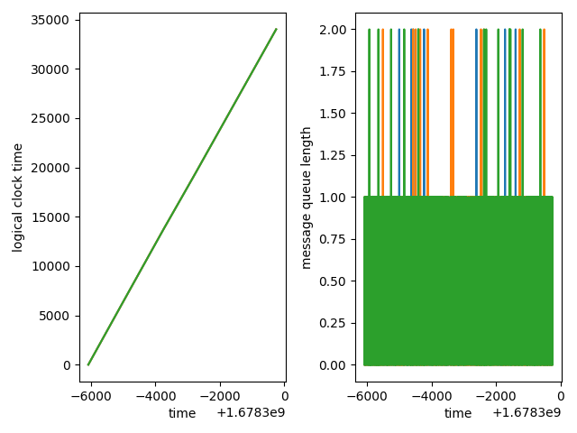
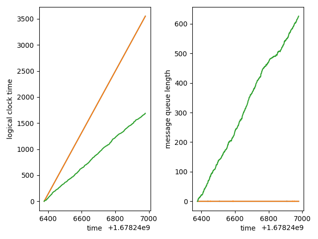
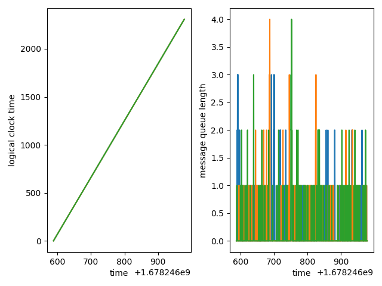
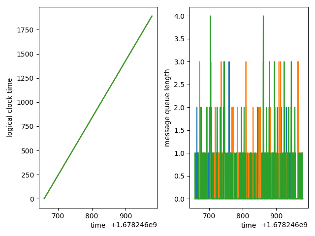

# Design Exercise: scale models and logical clocks
### Ari Troper, Liam McInroy, Max Snyder

A design experiment in logical clocks and their drift.

## Experiments results

Abbreviate X cycles / second to `Xc/s`.

Abbreviate probability of internal event to `p`.

In each pair of graphs, the left hand side is the logical clock times
(y-axis) versus the system time (x-axis). The right hand side is the
message queue size (y-axis) versus the system time (x-axis).

| - | - | - |
| ---------- | ------ | ---------- |
| `A1`: Three `6c/s`; `p=7/10` | `A2`: One `6c/s`; Two `1c/s`; `p=7/10` | `A3`: Two `6c/s`; One `1c/s`; `p=7/10` |
|  |   |  |
| | |
| `B1`: Three `6c/s`; `p=1/4` | `B2`: One `6c/s`; Two `1c/s`; `p=1/4` | `B3`: Two `6c/s`; One `1c/s`; `p=1/4` |
|  |   |  |
| | |
| `A4`: One `6c/s`; One `2c/s`; One `1c/s`; `p=7/10` | `A5`: One `6c/s`; One `4c/s`; One `2c/s`; `p=7/10` | `B4`: One `6c/s`; One `5c/s`; One `4c/s`; `p=1/4`
|  |  |  |

### Discussion

- If a machine processes at a rate roughly an order of magnitude slower
than the faster machines, then it will not ingest messages at fast enough rate to
correct its local logical clock. This increase in message queue size
causes some drift, as in `A2`, `A3`. In `A4`, we see that less than an order of
magnitude won't drift (the `2cs` doesn't drift).

- This increase in message queue size and drift may be mitigated by decreasing
the probability of internal events (`p`), as seen in the `B2` and `B3` variants
of `A2` and `A3`.

- Across all of the graphs, there may be increases in message queue size due
to probabilistic effects, i.e. one machine received messages from both other
machines during a single logical step (its own logical step). Looking at
`B4`, `B3`, and `A5`, we might conjecture drift won't occur if the message
size queue doesn't exceed, e.g., `10`.

## Setup and scripts

### Module installation

First, you should (preferably) setup and use a `virtualenv`.
This isn't required, but it is best practice.

```bash
source install.sh
```

### Running

### Start the system

To start the whole system of 3 machines, run

```bash
python -m clocks.system.main
```

### Testing

To run the tests, run

```bash
source runtests.sh
```

### Experimentts

To run the experiments yourself, run

```bash
source runexperiments.sh
```

The logs will end up in `logs/`,
while the figures will go in `figures/`

To just make the graphs from an experiment, run

```bash
source makegraphs.sh
```

### Linting

To lint all of the source code, run

```bash
source lint.sh
```

## Documentation

The general design is pretty straightforward:

- [`clocks.machine.main`](clocks/machine/main.py)
contains the code executed on each machine.

    - `MessageQueue` is a thread-safe message queue.

    - `logical_step` is the code that runs every logical clock time unit.

    - `start` sets up the socket to listen on for the message queue, by
    starting a new thread for `accept_clients`, and also calls `main`,
    which is the looping of `logical_step`. Note that `accept_clients` doesn't
    actually add to the message queues, it instead starts a thread for each
    client that runs `listen_client`, which adds to the message queue.

- [`clocks.system.main`](clocks/system/main.py)
contains the code to start up the three "machines" (as processes).

    - Starts three `multiprocesssing.Process` processes which each call
    `clocks.system.start`.

- [`clocks.common.config`](clocks/common/config.py)
contains some random configuration values.

To view the auto-generated, code-level documentation at
[`localhost:1234`](http://localhost:1234/clocks), run

```bash
source docshtml.sh
```
